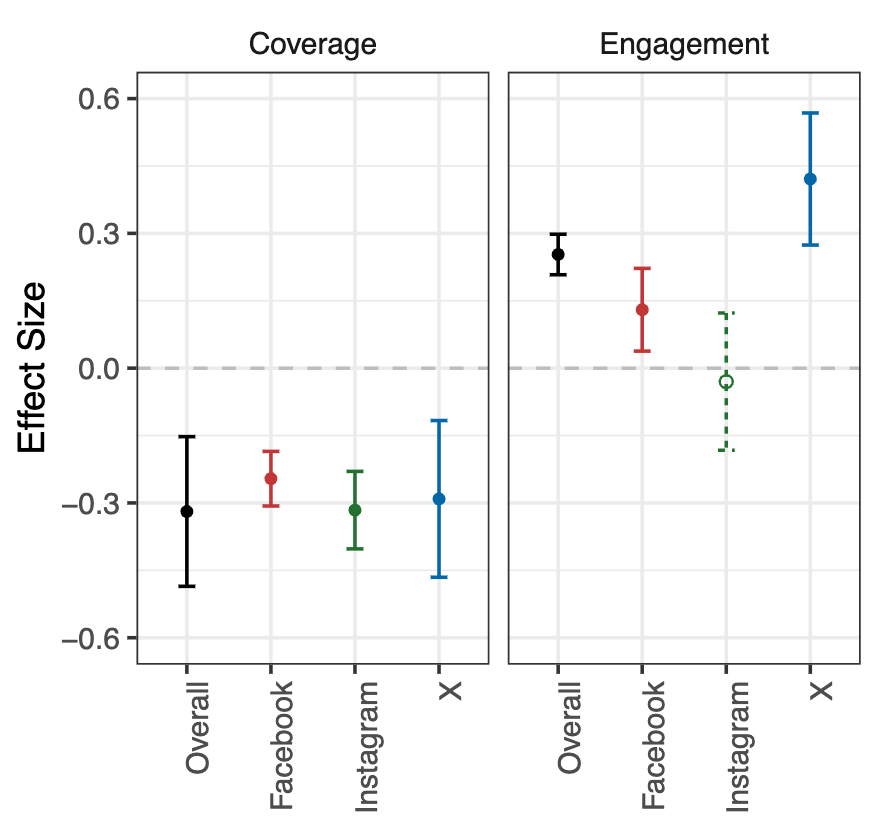

# Deplatforming Donald Trump Reduced His Media Coverage But Not Audience Engagement

This repository stores the needed data and files for replicating our paper.

  

## Files

- `data/`: stores the data for replication
- `code/`: stores the code for replication
- `README.md`: this file, providing an overview of the repository

## Replication

1. Clone / download this repository, and `cd` into the directory
2. Go to the directory of `code/`, e.g., `cd ./code/`
3. Run the R-script in `replication.R` to replicate the results, each replication will be commented with its DV and Platform

## Example Results
R version: `4.4.1 (2024-06-14)`

```
Loading required package: Matrix

Attaching package: ‘dplyr’

The following objects are masked from ‘package:stats’:

    filter, lag

The following objects are masked from ‘package:base’:

    intersect, setdiff, setequal, union

...

============= Replicating: Media Coverage / Instagram =============

Call:
   felm(formula = eq, data = df) 

Residuals:
     Min       1Q   Median       3Q      Max 
-0.39837 -0.07515 -0.01398  0.05269  0.60592 

Coefficients:
            Estimate Std. Error t value Pr(>|t|)    
(Intercept)  0.19013    0.03512   5.414 1.72e-07 ***
g            0.20674    0.03355   6.162 3.78e-09 ***
s            0.16937    0.04589   3.691 0.000287 ***
l            0.13145    0.04060   3.238 0.001407 ** 
log1p(pres)  1.29100    0.13840   9.328  < 2e-16 ***
log1p(gop)   1.23594    0.15296   8.080 5.59e-14 ***
g:s         -0.17556    0.06074  -2.890 0.004264 ** 
g:l         -0.31652    0.04428  -7.148 1.54e-11 ***
---
Signif. codes:  0 ‘***’ 0.001 ‘**’ 0.01 ‘*’ 0.05 ‘.’ 0.1 ‘ ’ 1

Residual standard error: 0.1338 on 204 degrees of freedom
Multiple R-squared(full model): 0.7182   Adjusted R-squared: 0.7085 
Multiple R-squared(proj model): 0.7182   Adjusted R-squared: 0.7085 
F-statistic(full model):74.26 on 7 and 204 DF, p-value: < 2.2e-16 
F-statistic(proj model): 74.26 on 7 and 204 DF, p-value: < 2.2e-16 

...

```

## Desensitization

Data in are aggregated and do not contain any sensitive information nor violating the terms of usage required by sources.

## Contact

If you have any questions, please contact our corresponding author, **; or **, who maintains the repository. Their emails are provided in the paper.

## Citation

- Link to our paper:
`TBD`
- APA
`TBD`
- BibTex
`TBD`
